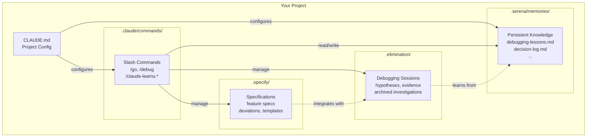
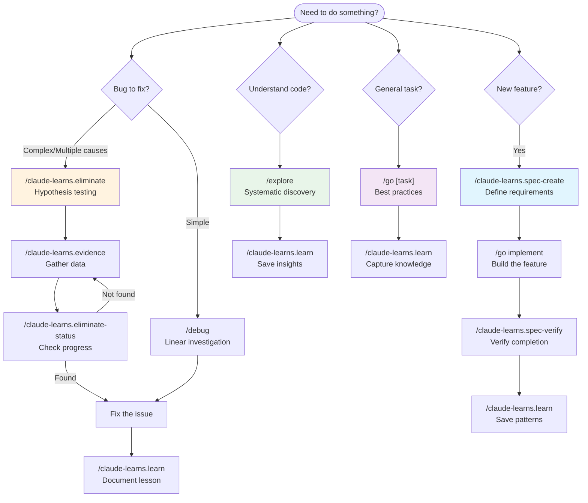

```
     ▗▄▖               ▗▖          ▗▄▖
     ▝▜▌               ▐▌          ▝▜▌
 ▟██▖ ▐▌   ▟██▖▐▌ ▐▌ ▟█▟▌ ▟█▙       ▐▌   ▟█▙  ▟██▖ █▟█▌▐▙██▖▗▟██▖
▐▛  ▘ ▐▌   ▘▄▟▌▐▌ ▐▌▐▛ ▜▌▐▙▄▟▌      ▐▌  ▐▙▄▟▌ ▘▄▟▌ █▘  ▐▛ ▐▌▐▙▄▖▘
▐▌    ▐▌  ▗█▀▜▌▐▌ ▐▌▐▌ ▐▌▐▛▀▀▘ ██▌  ▐▌  ▐▛▀▀▘▗█▀▜▌ █   ▐▌ ▐▌ ▀▀█▖
▝█▄▄▌ ▐▙▄ ▐▙▄█▌▐▙▄█▌▝█▄█▌▝█▄▄▌      ▐▙▄ ▝█▄▄▌▐▙▄█▌ █   ▐▌ ▐▌▐▄▄▟▌
 ▝▀▀   ▀▀  ▀▀▝▘ ▀▀▝▘ ▝▀▝▘ ▝▀▀        ▀▀  ▝▀▀  ▀▀▝▘ ▀   ▝▘ ▝▘ ▀▀▀
```

# claude-learns

A template for creating self-learning Claude Code projects with persistent memory and context management.

---

## What is claude-learns?

claude-learns helps Claude Code remember context across sessions and continuously improve its understanding of your codebase. It provides:

- **Persistent Memory**: Store and retrieve project knowledge across sessions
- **Self-Learning System**: Claude identifies patterns and insights, then offers to save them
- **Slash Commands**: Pre-built workflows for common development tasks
- **MCP Integration Ready**: Works with Serena, Context7, and other MCP servers

### Documentation

| Guide | Description |
|-------|-------------|
| [QUICKSTART.md](QUICKSTART.md) | Get productive in 5 minutes |
| [FAQ.md](FAQ.md) | Common questions answered |
| [EXAMPLES.md](EXAMPLES.md) | Real-world usage scenarios |

---

## Architecture

### How It All Fits Together



### Workflow Decision Tree



---

## Quick Start

### For Users

1. Clone this template:
   ```bash
   git clone https://github.com/danielcbright/claude-learns.git
   cd claude-learns
   ```

2. Copy from `template/` to your project:
   ```bash
   cp -r template/.claude /path/to/your/project/
   cp -r template/.serena /path/to/your/project/
   cp -r template/.elimination /path/to/your/project/
   cp -r template/.specify /path/to/your/project/
   cp template/CLAUDE.md /path/to/your/project/
   ```

3. Customize `CLAUDE.md` with your project details

### For AI Agents (Claude Code)

> **If you're Claude Code** and a user wants to install this template:

1. **Read `INSTALL.md`** - Contains step-by-step installation instructions
2. **Copy from `template/`** directory (not root-level files)
3. **Customize placeholders**: Replace `[PROJECT_NAME]`, `[PRIMARY_LANGUAGE]`, etc.
4. **Don't copy**: `README.md`, `INSTALL.md`, `DEVELOPMENT.md`, `.git/`, `test-projects/`

---

## What's Included

```
claude-learns/
├── CLAUDE.md                    # Main config (customize per project)
├── INSTALL.md                   # AI agent installation guide
├── README.md                    # This file
├── .claude/
│   ├── settings.local.json      # Local permissions
│   └── commands/                # Slash commands
│       ├── install.md           # /install - Install template
│       ├── go.md                # /go [task] - Start with best practices
│       ├── explore.md           # /explore [area] - Explore codebase
│       ├── debug.md             # /debug [issue] - Systematic debugging
│       ├── refactor.md          # /refactor [target] - Safe refactoring
│       ├── learn.md             # /learn - Learning loop review
│       ├── audit.md             # /audit - Documentation audit
│       ├── skills.md            # /skills - Discover skills
│       ├── eliminate.md         # /eliminate - Scientific elimination debugging
│       ├── hypothesis.md        # /hypothesis - Add hypothesis
│       ├── evidence.md          # /evidence - Record evidence
│       ├── eliminate-status.md  # /eliminate-status - View investigation
│       ├── eliminate-history.md # /eliminate-history - Search past sessions
│       ├── bisect.md            # /bisect - Git bisect integration
│       ├── spec-create.md       # /spec-create - Create specification
│       ├── spec-validate.md     # /spec-validate - Validate vs spec
│       ├── spec-debug.md        # /spec-debug - Debug with spec context
│       ├── spec-deviation.md    # /spec-deviation - Log intentional deviation
│       ├── spec-list.md         # /spec-list - List all specifications
│       ├── spec-verify.md       # /spec-verify - Verification gate
│       └── spec-correction.md   # /spec-correction - Capture corrections
├── .elimination/                # Scientific debugging system
│   ├── config.yaml              # Thresholds and settings
│   ├── active/                  # Current investigation
│   ├── archive/                 # Past investigations
│   ├── learned/                 # Heuristics and templates
│   ├── logs/                    # Elimination decisions
│   └── samples/                 # Reference YAML examples
├── .specify/                    # Specification-driven development
│   ├── config.yaml              # Spec-kit settings
│   ├── memory/
│   │   ├── constitution.md      # Non-negotiable project principles
│   │   └── corrections.md       # Logged corrections for /spec-verify
│   ├── specs/                   # Feature specifications
│   ├── templates/               # Spec templates
│   └── deviations/              # Intentional spec deviations
└── .serena/
    └── memories/
        ├── claude_code_patterns.md   # Session quick reference
        ├── elimination_patterns.md   # Debugging pattern reference
        ├── debugging-lessons.md      # Past bugs and resolutions
        ├── common-bugs.md            # Recurring patterns by feature
        ├── decision-log.md           # Why we chose X over Y
        └── tool-documentation.md     # Links to latest docs
```

## Available Slash Commands

### Core Commands

| Command | Purpose |
|---------|---------|
| `/claude-learns.install` | Install this template to a target project |
| `/claude-learns.update [tool]` | Update tools and template with git safety |
| `/go [task]` | Start task following best practices |
| `/explore [area]` | Systematically explore codebase area |
| `/debug [issue]` | Debug issue with structured approach |
| `/refactor [target]` | Safe refactoring workflow |
| `/claude-learns.learn` | Trigger learning loop review |
| `/claude-learns.audit` | Audit documentation for staleness |
| `/claude-learns.skills` | Re-discover and update skills |

### Scientific Elimination Debugging

| Command | Purpose |
|---------|---------|
| `/claude-learns.eliminate [symptom]` | Start elimination-based debugging session |
| `/claude-learns.hypothesis [desc]` | Add hypothesis to active investigation |
| `/claude-learns.evidence [H#] [obs]` | Record evidence for hypothesis evaluation |
| `/claude-learns.eliminate-status` | View current investigation state |
| `/claude-learns.eliminate-history` | Search past debugging sessions |
| `/claude-learns.bisect` | Git bisect integration for commit-level elimination |

### Specification-Driven Development

| Command | Purpose |
|---------|---------|
| `/claude-learns.spec-create [name]` | Create feature specification |
| `/claude-learns.spec-validate [name]` | Validate implementation against spec |
| `/claude-learns.spec-debug [name] [symptom]` | Debug using spec as source of truth |
| `/claude-learns.spec-deviation [name]` | Log intentional spec deviation |
| `/claude-learns.spec-list` | List all specifications |
| `/claude-learns.spec-verify [name]` | Verify with evidence before claiming done |
| `/claude-learns.spec-correction` | Capture correction when claim was wrong |

## Scientific Elimination Debugging

A systematic approach to debugging based on the scientific method and Bayesian reasoning.

### Core Principle

> "When you have eliminated the impossible, whatever remains, however improbable, must be the truth." — Sherlock Holmes

### When to Use

Use `/claude-learns.eliminate` instead of `/debug` when:
- Multiple possible causes exist
- Initial debugging hasn't found root cause
- Issue is intermittent or timing-dependent
- You need to track hypotheses systematically

### Workflow

1. **Generate Hypotheses** - Create 3-7 hypotheses across domains (Code, Config, Dependencies, Data, Infrastructure, Concurrency)
2. **Gather Evidence** - Design tests that discriminate between hypotheses
3. **Update Confidence** - Apply Bayesian updates based on evidence
4. **Eliminate** - Remove hypotheses below threshold (soft at 0.25, hard at 0.05)
5. **Verify** - Confirm fix resolves the issue
6. **Learn** - Update heuristics and archive session

### Example

```bash
# Start debugging
/eliminate "API returning 500 errors intermittently"

# Add a hypothesis
/hypothesis "Redis connection timeout" --confidence 0.6

# Record evidence
/evidence H1 "Connection pool at 45% capacity" --contradicts

# Check status
/eliminate-status

# View past sessions
/eliminate-history --search "timeout"
```

### Key Files

- `.elimination/config.yaml` - Thresholds and settings
- `.elimination/samples/` - Reference YAML examples for file structure
- `.elimination/learned/heuristics.yaml` - Patterns learned from debugging
- `.serena/memories/elimination_patterns.md` - Quick reference guide

## Specification-Driven Development

Define expected behavior before implementation, then use specs for validation and debugging.

### Core Concept

Specifications serve as the source of truth. When behavior doesn't match the spec:
- It's either a bug (fix the implementation)
- Or an intentional deviation (document it)

### When to Use

| Scenario | Command |
|----------|---------|
| Starting new feature | `/claude-learns.spec-create` first |
| Checking implementation | `/claude-learns.spec-validate` |
| Debugging specced feature | `/claude-learns.spec-debug` |
| Intentional behavior change | `/claude-learns.spec-deviation` |

### Integration with Elimination Debugging

`/claude-learns.spec-debug` combines specification analysis with elimination debugging:
1. Loads the feature specification
2. Compares expected vs actual behavior
3. Generates hypotheses from spec deviations (elevated confidence: 0.70)
4. Continues with standard elimination workflow

### Key Files

- `.specify/config.yaml` - Spec-kit settings
- `.specify/memory/constitution.md` - Non-negotiable project rules
- `.specify/specs/` - Feature specifications
- `.specify/templates/` - Templates for new specs
- `.specify/deviations/` - Documented intentional deviations

## Learning Loop System

The template includes a continuous improvement system:

1. **During work**: Claude identifies patterns, gotchas, insights
2. **At breakpoints**: Claude offers structured recommendations
3. **On approval**: Updates are written to memories and CLAUDE.md

This creates an ever-improving knowledge base for your project.

## Update System

Keep your tools and template up to date with the `/claude-learns.update` command:

```bash
/update                     # Check all tools for updates
/update claude-learns       # Update the template
/update serena              # Update Serena MCP
/update --all               # Update all registered tools
/update --rollback          # Rollback if something goes wrong
```

### Safety Features

- **Git checkpoint**: Creates a commit before any update
- **Rollback**: Use `/claude-learns.update --rollback` to undo updates
- **Protected files**: Your memories and specs are never modified
- **Web-based**: Always fetches latest instructions from source

### Tool Registry

The update system tracks tools in `.claude/update-registry.yaml`:
- claude-learns template
- Serena MCP
- Context7
- Any future tools you add

See `UPDATE.md` for changelog and detailed update documentation.

## MCP Integration

claude-learns works well with these MCP servers:

- **Serena**: Code navigation and symbol lookup
- **Context7**: External library documentation
- **Sequential Thinking**: Complex architectural decisions

Configure MCP servers in your Claude Code settings as needed.

## Customization

### CLAUDE.md

Edit these sections for your project:

1. **Project Overview** - Fill in project details
2. **Key Entry Points** - Document commonly searched symbols
3. **Current Memories** - Update after creating memories
4. **Project-Specific Patterns** - Document coding conventions
5. **Active Skills** - Add relevant skills

### Memories

Edit `.serena/memories/claude_code_patterns.md`:

1. Update test/lint/build commands
2. Add project-specific gotchas
3. Document your architecture

## Requirements

- Claude Code CLI

## For Developers

If you're contributing to claude-learns itself, read `DEVELOPMENT.md`.

### Dual-Location Architecture

This repository uses a dual-location architecture to solve the bootstrapping problem:

```
claude-learns/
├── .claude/, .serena/, etc.   # Working copies (for development)
├── template/                   # Clean distributable copies
│   ├── .claude/
│   ├── .serena/
│   ├── .elimination/
│   ├── .specify/
│   └── CLAUDE.md
└── test-projects/              # Installation test targets
```

- **Root-level files**: Used for developing and testing the template
- **`template/`**: Clean copies that get distributed to users
- **`test-projects/`**: Minimal project skeletons for testing installation

### Development Workflow

1. Make changes to root-level files
2. Test commands naturally (they modify root files)
3. Sync changes to `template/` when satisfied
4. Ensure `template/` has placeholders, not dev-specific content
5. Test installation with `/claude-learns.install test-projects/minimal-js`

See `DEVELOPMENT.md` for full details.

## License

MIT - Use freely in your projects.
